# 📘 SSD Class 2: Object-Oriented Deep Dive & Advanced Inheritance
**Software Systems Development (CRN 12391) · Week 1 · Day 2**  
**The British College, Kathmandu (Awarded by Leeds Beckett University)**  
**Lecturer & Tutor:** Sudan Pudasaini · **Module Leader (LBU):** Mark Dixon  

---

## ⏱️ Lesson Timeline & Structure (100 Minutes Total)

```mermaid
gantt
    title Week 1 · Day 2 Class Delivery Timeline
    dateFormat mm
    axisFormat %M min
    section Theory (40m)
    Encapsulation Invariants & Modifiers  :00, 15m
    Constructor Chaining & super()        :15, 15m
    Abstract Classes & Dynamic Dispatch   :30, 10m
    section Code Demo (15m)
    Shape Hierarchy Live Code Review      :40, 15m
    section Hands-On Lab (30m)
    Lab 1: Circle & Triangle in IntelliJ  :55, 30m
    section Assessment & Wrap (15m)
    Component 2 Formative MCQ Drill       :85, 10m
    Milestone 1 Wrap-up (57 Topics)       :95, 05m
```



---

## 🎯 Pedagogical Objectives

1. **Shift Mental Models:** Move students from simple syntax to **invariant-driven encapsulation** (why fields can *never* be public in production systems).
2. **Master Constructor Mechanics:** Explain why constructors are **never inherited**, the mandatory execution order of `super(...)`, and lateral chaining with `this(...)`.
3. **Understand Architectural Abstraction:** When to use abstract classes (shared state + abstract method contracts).
4. **Demystify Dynamic Method Dispatch:** Walk through the JVM `invokevirtual` instruction, runtime heap pointers, and the Virtual Method Table (vtable).
5. **Practical Mastery:** Complete `Circle.java` and `Triangle.java` in `starter-repos/week1-starter` and pass all JUnit 5 tests.
6. **Formative Exam Prep:** Drill 5 Component 2 exam-style questions on constructor chaining and inheritance traps.

---

## 🧠 Section 1: Deep-Dive Concept Notes

### 1. Encapsulation & System Invariants
- **What is an invariant?** An invariant is a state rule that must hold true at every moment of an object's existence.
- **Why public fields fail:** If a field like `public double balance;` is exposed, external code can write `acc.balance = -99999;`. In multi-threaded or networked environments, finding which line corrupted the state becomes nearly impossible.
- **Defensive Design:**
  - Make all fields `private`.
  - Validate state transitions inside constructors and mutating methods.
  - Throw clear unchecked exceptions (`IllegalArgumentException` or `IllegalStateException`) upon invariant violations.

### 2. The 4 Java Visibility Modifiers
| Modifier | Scope | Typical Use Case |
|---|---|---|
| `private` | Current class body only | Instance variables and internal implementation details. |
| *(default / package-private)* | Current package only | Collaborating classes within the same package. |
| `protected` | Current package + subclasses anywhere | Framework extension points meant for subclasses to override. |
| `public` | Everywhere globally | Public API contracts, interface definitions, entry-point constructors. |

> ⚠️ **Overriding Rule for Exams:** A subclass method **cannot reduce visibility** below what the superclass specified. If the base class method is `protected`, the subclass method must be `protected` or `public`.

### 3. Constructor Chaining (`super(...)` and `this(...)`)
- **Key Principle:** A subclass **does not inherit constructors**.
- **Execution Order:** Before a derived object's constructor body executes, the direct superclass constructor must execute.
- **Mandatory First Statement:** `super(...)` or `this(...)` must be statement #1.
- **Default Constructor Trap:** If you don't write `super(...)`, the compiler injects `super();`. If the superclass has defined a parameterized constructor (and thus no longer has a default 0-arg constructor), your subclass code will fail to compile unless you explicitly call `super(args)`.

### 4. Dynamic Method Dispatch & The JVM Vtable
- In Java, all non-static, non-private, non-final methods are **virtual** by default.
- When calling `shape.getArea()` where `Shape shape = new Circle(4.0);`:
  1. **Compile Time:** The Java compiler checks that `Shape` declares `getArea()`. It emits bytecode: `invokevirtual #14`.
  2. **Runtime:** The JVM inspects the object header on the Heap (`Circle`), accesses its Virtual Method Table (vtable), and invokes the pointer to `Circle.getArea()`.
- **Late Binding:** The method executed depends on the actual heap object, not the variable's declared reference type.

---

## 💻 Section 2: Lab 1 Technical Walkthrough

### Repository Structure
```
starter-repos/week1-starter/
├── pom.xml                                   (Java 21 + JUnit 5.10.2)
└── src/
    ├── main/java/shapes/
    │   ├── Shape.java                        (Abstract base class)
    │   ├── Square.java                       (Reference concrete class)
    │   ├── Circle.java                       (Student Task 2)
    │   ├── Triangle.java                     (Student Task 3)
    │   └── Driver.java                       (Polymorphic execution)
    └── test/java/shapes/
        └── ShapeTest.java                    (JUnit 5 test suite)
```

### Reference Implementation & Solutions

#### Task 2: `Circle.java`
```java
package shapes;

public class Circle extends Shape {
    private double radius;

    public Circle(double radius) {
        super(0); // A circle has 0 straight sides
        if (radius <= 0) {
            throw new IllegalArgumentException("Radius must be greater than zero");
        }
        this.radius = radius;
    }

    public double getRadius() { return radius; }

    public void setRadius(double radius) {
        if (radius <= 0) {
            throw new IllegalArgumentException("Radius must be greater than zero");
        }
        this.radius = radius;
    }

    @Override
    public double getArea() {
        return Math.PI * radius * radius;
    }

    @Override
    public double getPerimeter() {
        return 2 * Math.PI * radius;
    }
}
```

#### Task 3: `Triangle.java`
```java
package shapes;

public class Triangle extends Shape {
    private double sideA;
    private double sideB;
    private double sideC;

    public Triangle(double sideA, double sideB, double sideC) {
        super(3);
        if (sideA <= 0 || sideB <= 0 || sideC <= 0) {
            throw new IllegalArgumentException("Sides must be positive numbers");
        }
        // Triangle Inequality Theorem
        if (sideA + sideB <= sideC || sideA + sideC <= sideB || sideB + sideC <= sideA) {
            throw new IllegalArgumentException("Violated triangle inequality theorem");
        }
        this.sideA = sideA;
        this.sideB = sideB;
        this.sideC = sideC;
    }

    @Override
    public double getPerimeter() {
        return sideA + sideB + sideC;
    }

    @Override
    public double getArea() {
        // Heron's Formula
        double s = getPerimeter() / 2.0;
        return Math.sqrt(s * (s - sideA) * (s - sideB) * (s - sideC));
    }
}
```

### Running and Verifying
```bash
# Run all automated tests
mvn test

# Run polymorphic driver
mvn compile exec:java -Dexec.mainClass="shapes.Driver"
```

---

## 🧠 Section 3: Component 2 Formative MCQ Drill (Exam Prep)

### Question 1: Abstract Class Constructors
**Q:** Can an `abstract class` in Java define a constructor?  
- **A)** No, because abstract classes cannot be instantiated with `new`.  
- **B)** Yes, and it is invoked via `super(...)` from subclass constructors.  
- **C)** Only if all methods inside the class are concrete.  
- **D)** Only private constructors are allowed.  
> **Correct Answer: B**  
> **Explanation:** An abstract class cannot be instantiated directly via `new`, but it can—and often does—have constructors. When a concrete subclass constructor executes, it calls `super(...)` to initialize the superclass fields.

---

### Question 2: Constructor Placement
**Q:** Where must an explicit call to `super(...)` or `this(...)` appear inside a constructor body?  
- **A)** Anywhere before the first return statement.  
- **B)** As the absolute first statement of the constructor body.  
- **C)** As the last statement after initializing instance fields.  
- **D)** Inside a static initialization block.  
> **Correct Answer: B**  
> **Explanation:** The Java Language Specification (JLS §8.8.7) mandates that if present, an explicit constructor invocation (`super(...)` or `this(...)`) must be the very first statement.

---

### Question 3: Overriding Method Visibility
**Q:** If a superclass defines `protected void render()`, what visibility can the overriding method in a subclass specify?  
- **A)** Only `protected`.  
- **B)** `protected` or `public`.  
- **C)** Only `public`.  
- **D)** Any visibility modifier, including `private`.  
> **Correct Answer: B**  
> **Explanation:** In Java, an overriding method cannot assign weaker access privileges than the overridden method. Since the base method is `protected`, the derived method can maintain `protected` or widen to `public`. It cannot be narrowed to default or `private`.

---

### Question 4: Dynamic Method Dispatch
**Q:** Given the code:
```java
Shape s = new Circle(4.0);
System.out.println(s.getArea());
```
Which implementation of `getArea()` will be executed?  
- **A)** `Shape.getArea()`, because `s` is declared as type `Shape`.  
- **B)** A runtime `ClassCastException` is thrown.  
- **C)** `Circle.getArea()`, dynamically resolved at runtime by the JVM.  
- **D)** Both execute sequentially.  
> **Correct Answer: C**  
> **Explanation:** The reference type `Shape` is used by the compiler to verify that `getArea()` exists. At runtime, the JVM uses dynamic method dispatch (`invokevirtual`) to look up the vtable of the concrete object (`Circle`) and executes `Circle.getArea()`.

---

### Question 5: Default Constructor Suppression
**Q:** Consider the following classes:
```java
class Vehicle {
    public Vehicle(String registration) { }
}
class Car extends Vehicle {
    public Car() { }
}
```
What happens when you compile this code?  
- **A)** Compiles cleanly; `Car` automatically passes `null` to `Vehicle`.  
- **B)** Compile error in `Car`: no default (parameterless) constructor exists in `Vehicle`.  
- **C)** Compile error in `Vehicle`: constructors must return a value.  
- **D)** Compiles cleanly, but throws a `NullPointerException` at runtime.  
> **Correct Answer: B**  
> **Explanation:** Because `Vehicle` explicitly declares `Vehicle(String)`, the compiler does NOT generate a default parameterless `Vehicle()` constructor. Since `Car()` does not explicitly call `super(...)`, the compiler tries to insert `super();`, which does not exist in `Vehicle`, causing a compile-time error.

---

## 👥 Section 4: Milestone 1 Wrap-Up Checklist

By the end of Week 1, all students must:
1. **GitHub Org Verification:** Accept the invite to `@The-British-College-Nepal` and initialize their private repository `ssd-lab-<username>` from `ssd-2026-week1-starter`.
2. **Push Completed Lab 1:** Ensure all 7 JUnit tests in `ShapeTest.java` pass with green checkmarks on GitHub Actions.
3. **Form Component 1 Squads:**
   - 4 students per team.
   - Claim 1 unique topic from the **57 approved topics**.
   - Allocate the 4 mandatory roles:
     - 🏛️ **Role 1:** Team Manager / System Architect
     - 🖥️ **Role 2:** Server-Side Programmer
     - 📱 **Role 3:** Client-Side Programmer
     - 🧪 **Role 4:** Automated Test Engineer
